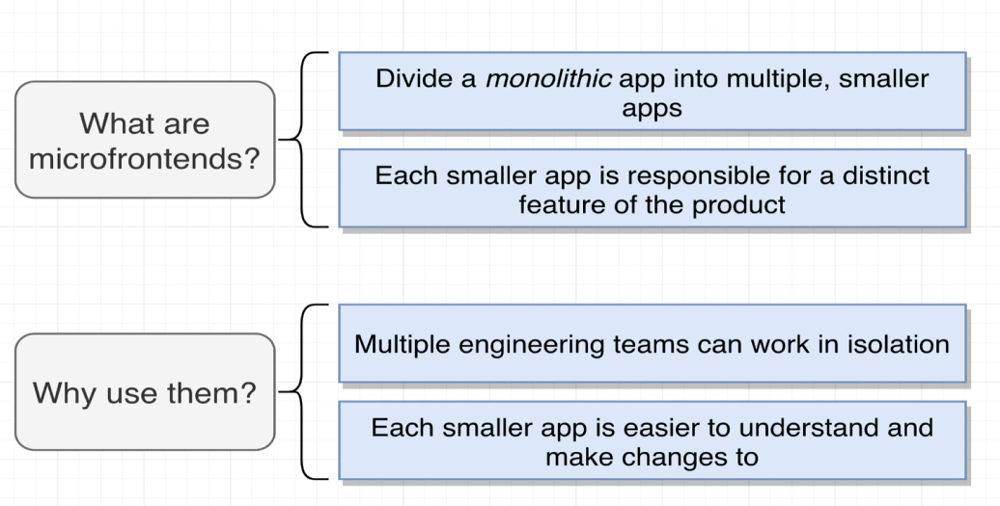
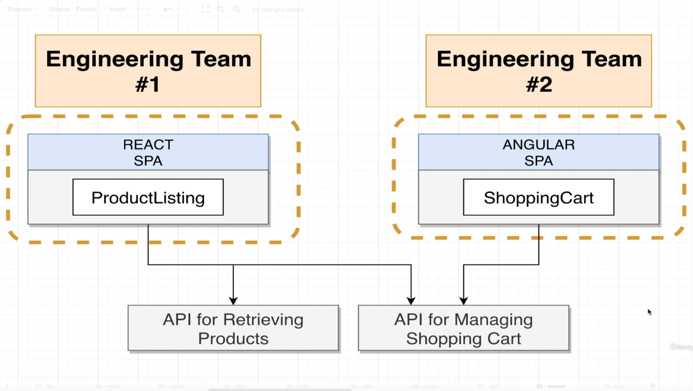

# Microfrontends

# What is microfront end architecture?

Micro front-end architecture is a modern approach to front-end development that involves breaking down a large, monolithic front-end application into smaller, more manageable, and independent units called **micro front-ends**. Each micro front-end is developed, deployed, and maintained independently, often by different teams, and they work together seamlessly to form a complete application.

### Key Concepts of Micro Front-End Architecture:

1. **Independent Teams**: Teams focus on individual features or parts of the application and have ownership over their micro front-ends.
2. **Technology Agnostic**: Different micro front-ends can use different frameworks or technologies, provided they conform to agreed-upon standards for integration.
3. **Decentralized Development**: Teams can independently build, test, and deploy their micro front-end components without coordinating with other teams.
4. **Composable UI**: The application UI is composed of multiple micro front-ends, which are stitched together at runtime.

---

### Benefits:

1. **Scalability**: Allows teams to scale independently, focusing on their specific domain.
2. **Flexibility**: Teams can choose the most suitable technology for their micro front-end.
3. **Maintainability**: Smaller, isolated codebases are easier to maintain and debug.
4. **Parallel Development**: Multiple teams can work on the same application simultaneously without stepping on each other’s toes.
5. **Incremental Updates**: Individual micro front-ends can be updated independently without affecting the entire application.

---

### Challenges:

1. **Integration Complexity**: Combining multiple micro front-ends seamlessly requires careful orchestration.
2. **Performance Overhead**: Increased need for coordination between multiple micro front-ends at runtime.
3. **Consistent User Experience**: Ensuring a unified look and feel across micro front-ends can be challenging.
4. **Cross-Team Communication**: Teams need clear communication and agreements on shared standards.

---

### Implementation Approaches:

1. **Web Components**: Using web standards like Custom Elements and Shadow DOM for encapsulation.
2. **Iframe-Based Isolation**: Embedding micro front-ends in iframes for strict isolation, though it can be heavy.
3. **Module Federation (Webpack)**: Sharing modules and dependencies between micro front-ends at runtime.
4. **Build-Time Integration**: Combining micro front-ends during the build process.
5. **Server-Side Composition**: Combining micro front-ends on the server side before delivering them to the client.

---

### When to Use Micro Front-End Architecture:

- Large-scale applications with multiple teams working on different domains.
- Applications that need to be incrementally migrated from legacy systems.
- Scenarios where agility, team autonomy, and scalability are top priorities.

