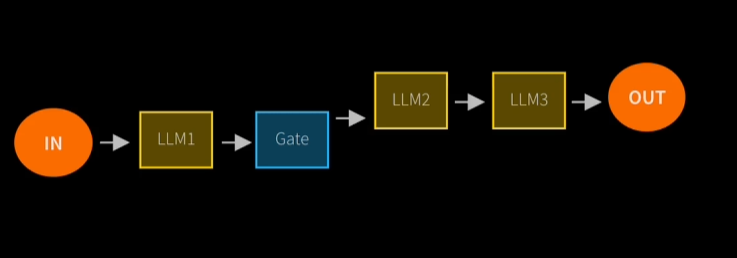
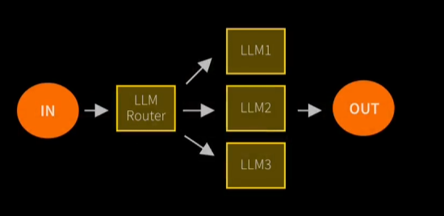
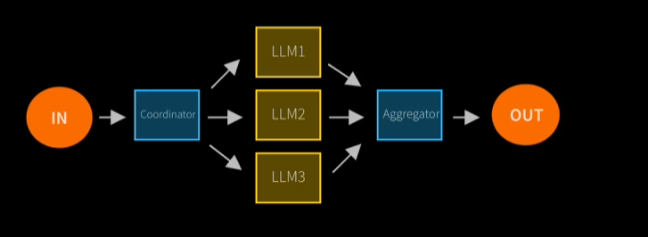
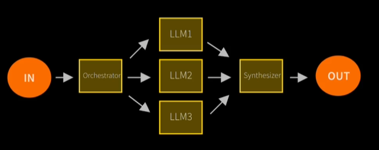
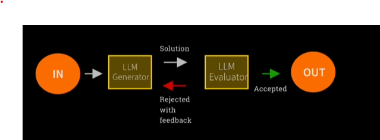

# Autonomous AI Agent

[udemy course](udemy.com/course/the-complete-agentic-ai-engineering-course/)

Flexible AI workflow automation for technical teams. it is a low code no code tool to see agentic ai in action.
[n8n site](https://n8n.io/)
[n8n quick start](https://www.youtube.com/watch?v=4cQWJViybAQ)

## Project setup

[IDE: Cursor](https://cursor.com/)
[Package Manager: uv](https://docs.astral.sh/uv/getting-started/installation/)
[ed-donnner gituhub](https://github.com/ed-donner/agents)

## Agents

AI agents are programs where LLM ouputs control the workflow.

### Agentic Systems

Anthropic distinguishes two types:

***WORKFLOWS*** are systems where LLMS and tools are orchestrated through predefined code paths.

***Agents*** are systems where LLMs dynamically direct their own processes and toll usaage, maintaining control over how they accomplish tasks.

## Workflow Design Patterns

1. Prompt Chaining : Chain of prompts that will be executed one after another to generate a final output.

2. Routing : Direct an input into a specialized sub-task,ensuring separation of concerns.

3. Parallelization: Breaking down tasks and running multiple subtasks concurrently.

4. Orchestrator-Worker: Complex tasks are broken down dyamically combined without any codes. Everything will be orchstrated by LLMs.

5. Evaluator-Optimizer: LLM output is vaidated by another.
