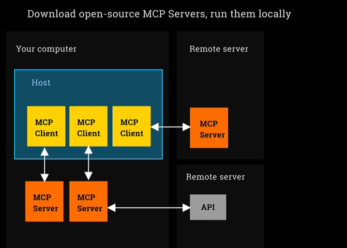

# MCP (Model Context Protocol)

What its not
- A framework for building agents.
- A fundamental change to how agents work.
- A way to code agents.

What it is
- A protocol - a standard.
- A simple way to integrate tools, resources, prompts written by others.
- its a USB-C port for AI applications.

# MCP Core Concepts

The three components:

- Host is an LLM app like Claude or our Agent architecture.
- MCP Client lives inside Host ad connects 1:1 to MCP server.
- MCP Server provides tools, context and prompts.

Examples:

- `Fetch` is an MCP Server that searches the web via a headless browser.
- You can configure Claude Desktop (the host) to run an MCP Client that then launches the Fetch MCP Server on your computer.

# Architecture

- MCP Servers usually runs on your machine.

# The Two Transport Mechanism for MCP Servers

- stdio: spawns a process and communucate via standard input/output (Most common way to do it)
- SSE: Server side events: 

# Making an MCP Server

## Why make an MCP Server
- Allow others to incorporate tools and resources. Other can integrate with their agents.
- Consistently incorporate all our MCP Servers.
- Understand the plumbing.

## Reasons not to make an MCP Server

- if its only for us, then we could just make tools - the @function_tool decorator can make any function into a tool.